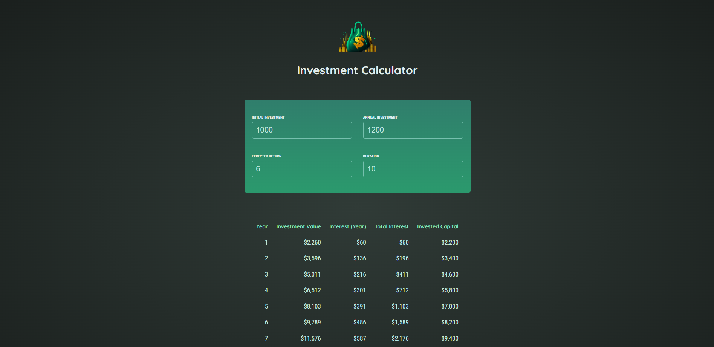

# React Investment Calculator

A React application that calculates investment returns over time based on initial investment, annual contributions, expected return rate, and investment duration.



## Features

- Calculate compound investment returns
- Interactive input form for investment parameters
- Real-time calculation results
- Clean, modern UI with gradient styling

## Getting Started

### Prerequisites

- Node.js (version 14 or higher)
- npm or yarn

### Installation

1. Clone the repository:
```bash
git clone <repository-url>
cd React-Essentials
```

2. Install dependencies:
```bash
npm install
```

3. Start the development server:
```bash
npm run dev
```

4. Open your browser and navigate to `http://localhost:5173`

## Technologies Used

- React 19
- Vite
- CSS3 with custom styling
- Google Fonts (Quicksand, Roboto Condensed)

## Project Structure

```
src/
├── components/
│   ├── Header.jsx
│   └── UserInput.jsx
├── util/
│   └── investment.js
├── assets/
│   └── investment-calculator-logo.png
├── App.jsx
├── index.css
└── index.jsx
```